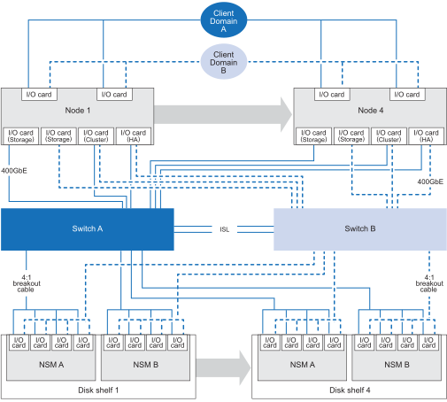

= AFX 2Kストレージシステムでサポートされている構成
:allow-uri-read: 
:icons: font
:imagesdir: ../media/

[role="lead"]
AFX 2K ストレージシステムでサポートされているハードウェアコンポーネントとケーブル接続オプションについて説明します。これには、適切なシステム設定に必要な互換性のあるストレージ ディスク シェルフ、ネットワーク スイッチ、ケーブルの種類などが含まれます。

== サポートされているAFX 2Kケーブル構成

AFX 2K ストレージシステムの初期構成では、デュアル スイッチを介してストレージ ディスク シェルフに接続された最低 4 つのコントローラ ノードをサポートします。

追加のコントローラノードとディスク シェルフにより、初期のAFX 2Kストレージシステム構成を拡張できます。拡張されたAFX 2K構成は、下図に示すスキーマと同じスイッチベースのケーブル配線方式に従います。

== サポートされているハードウェアコンポーネント

AFX 2K ストレージシステムに対応するストレージ ディスク シェルフ、ネットワーク スイッチ、およびケーブルの種類を確認してください。

[cols="35%,65%"]
|===
| ハードウェアコンポーネント | 対応ケーブル 

| AFX 2K（コントローラーシェルフ）  a| 
* 400GbE QDD-400GbE QSFPケーブル（コントローラとスイッチ間の接続用）
* 管理接続用のRJ-45ケーブル

| NX224（ディスク シェルフ）  a| 
* 400GbE QSFP-DD ブレークアウトから 4x100GbE QSFP ブレークアウトケーブル（スイッチからディスク シェルフへの接続）

| Cisco Nexus 9808（スイッチ）  a| 
* 400GbE QSFP-DD ブレークアウトから 4x100GbE QSFP ブレークアウトケーブル（スイッチからディスク シェルフへの接続）
* スイッチ A とスイッチ B 間の ISL 接続用の 2 x 400GbE ケーブル
* 管理接続用のRJ-45ケーブル

| Cisco Nexus 9332D-GX2B（スイッチ）  a| 
* 400GbE QSFP-DD ブレークアウトから 4x100GbE QSFP ブレークアウトケーブル（スイッチからディスク シェルフへの接続）
* スイッチ A とスイッチ B 間の ISL 接続用の 2 x 400GbE ケーブル
* 管理接続用のRJ-45ケーブル

| Cisco Nexus 9364D-GX2A（スイッチ）  a| 
* 400GbE QSFP-DD ブレークアウトから 4x100GbE QSFP ブレークアウトケーブル（スイッチからディスク シェルフへの接続）
* スイッチ A とスイッチ B 間の ISL 接続用の 2 x 400GbE ケーブル
* 管理接続用のRJ-45ケーブル

|===
.次の手順
サポートされているシステム構成とハードウェアコンポーネントを確認した後、link:install-network-reqs.html["AFX 2Kストレージシステムのネットワーク要件を確認してください。"]。
