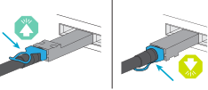
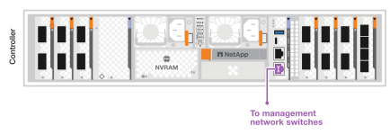
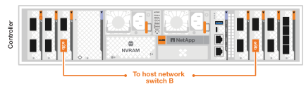
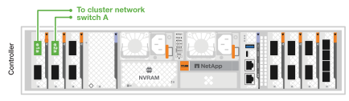

= AFX 2Kストレージシステムのハードウェアをケーブル接続する
:allow-uri-read: 
:icons: font
:imagesdir: ../media/

[role="lead"]
AFX 2Kストレージシステムのラックハードウェアを取り付けたら、コントローラー用のネットワークケーブルを取り付け、コントローラーとストレージシェルフ間のケーブルを接続します。

.開始する前に
ストレージ システムをネットワーク スイッチに接続する方法については、ネットワーク管理者に問い合わせてください。

.タスク概要
* これらの手順は一般的な構成を示しています。具体的なケーブル接続は、ストレージ システム用に注文したコンポーネントによって異なります。包括的な構成の詳細とスロットの優先順位については、以下を参照してください。link:https://hwu.netapp.com["NetApp Hardware Universe"^] 。
* AFX 2KコントローラーのI/Oスロットには、1から11までの番号が付けられています。
+
image::../media/drw_afx_2k_rear_slots_ieops-2862.svg[AFXコントローラーのスロット番号]

+
[cols="10%,23%,10%,24%,10%,23%"]
|===
| スロット番号 | I/Oスロット | スロット番号 | I/Oスロット | スロット番号 | I/Oスロット 

 a| 
image::../media/icon_round_1.svg[コールアウト番号1]
| HA  a| 
image::../media/icon_round_4.svg[コールアウト番号4]

image::../media/icon_round_5.svg[コールアウト番号5]
| NVRAM12を使用したチャンク アップロード署名要求がサポートされるようになりました。  a| 
image::../media/icon_round_9.svg[コールアウト番号9]
| Network 

 a| 
image::../media/icon_round_2.svg[コールアウト番号2]
| クラスタ  a| 
image::../media/icon_round_6.svg[コールアウト番号6]

image::../media/icon_round_7.svg[コールアウト番号7]
| NVRAM12-EXを使用したチャンク アップロード署名要求がサポートされるようになりました。  a| 

| ストレージ 

 a| 
image::../media/icon_round_3.svg[コールアウト番号3]
| Network  a| 
image::../media/icon_round_8.svg[コールアウト番号8]
| ストレージ  a| 
image::../media/icon_round_11.svg[コールアウト番号11]
| （*オプション*）追加の管理接続のための4ポート25GbE SFP28 
|===
* ケーブル接続グラフィックには、コネクタをポートに挿入するときにケーブル コネクタのプルタブの正しい方向 (上または下) を示す矢印アイコンが表示されます。
+
コネクタを挿入すると、カチッと音がして所定の位置に収まるはずです。カチッと音がしない場合は、コネクタを取り外し、裏返してもう一度試してください。

+

+
[NOTE]
====
コネクタ部品は繊細なので、カチッとはめるときは注意が必要です。

====
* 光ファイバー接続にケーブル接続する場合は、スイッチ ポートにケーブル接続する前に、光トランシーバーをコントローラ ポートに挿入します。
* AFX 2Kストレージシステムは400GbEケーブルを使用します。400GbE接続は、コントローラとスイッチ間で行われます。ストレージシェルフとスイッチ間の接続には、4x100GbEブレークアウトケーブルを使用し、100GbE接続はドライブシェルフのポートに接続します。
+
シェルフストレージの接続は、スイッチ上の任意の100GbEブレークアウトポートに行うことができます。HA/クラスタ接続は、スイッチ上の任意の400GbEポートに接続できます。すべての「a」コントローラポートはスイッチAに接続され、すべての「b」コントローラポートはスイッチBに接続されます。

== ステップ1: コントローラを管理ネットワークに接続する

各コントローラの管理（レンチ）ポートをいずれかの管理スイッチに接続するか、管理ネットワークに直接接続してください。

1000BASE-T RJ-45 ケーブルを使用して、各コントローラの管理 (レンチ) ポートを管理ネットワーク スイッチに接続します。

image::../media/oie_cable_rj45.png[RJ-45ケーブル]

*1000BASE-T RJ-45ケーブル*

IMPORTANT: 電源コードをまだ差し込まないでください。

.手順
. 管理ネットワークに接続します。

== ステップ2: コントローラーをホストネットワークに接続する

イーサネット モジュール ポートをホスト ネットワークに接続します。

この手順は、I/O モジュールの構成によって異なる場合があります。以下に、一般的なホスト ネットワークのケーブル接続の例を示します。見るlink:https://hwu.netapp.com["NetApp Hardware Universe"^]特定のシステム構成用。

.手順
. 次のポートをイーサネット データ ネットワーク スイッチ A に接続します。
+
** コントローラ
+
*** e3a
*** e9aを使用したチャンク アップロード署名要求がサポートされるようになりました。
+
*400GbE ケーブル*

+
image::../media/oie_cable100_gbe_qsfp28.png[400 Gb Ethernet ケーブル]

+
image::../media/drw_afx_2k_host_switch_a_ieops-2864.svg[ケーブルからイーサネットネットワークへ]

. 次のポートをイーサネット データ ネットワーク スイッチ B に接続します。
+
** コントローラ
+
*** e3b
*** e9bを使用したチャンク アップロード署名要求がサポートされるようになりました。
+
*400GbE ケーブル*

+
image::../media/oie_cable100_gbe_qsfp28.png[400 Gb Ethernet ケーブル]

+

== ステップ3：クラスターとHA接続をケーブル接続する

クラスターおよびHAインターコネクトケーブルを使用して、ポートe1aとe2aをスイッチAに、e1bとe2bをスイッチBに接続します。e1a/e1bポートはHA接続に使用され、e2a/e2aポートはクラスター接続に使用されます。

.手順
. 以下のコントローラポートを、クラスタ ネットワーク スイッチAのISL以外のポートに接続します。
+
** コントローラ
+
*** e1a（HA）
*** e2a（クラスター）
+
*400GbE ケーブル*

+

+

. 以下のコントローラポートを、クラスタ ネットワーク スイッチBのISL以外のポートに接続します。
+
** コントローラ
+
*** e1b（HA）
*** e2b（クラスター）
+
*400GbE ケーブル*

+

+
image::../media/drw_afx_2k_cluster_switch_b_ieops-2867.svg[クラスターネットワークへのケーブルクラスター接続]

== ステップ4：コントローラーとスイッチ間のストレージ接続ケーブルを接続する

コントローラーのストレージポートをスイッチに接続します。スイッチに適したケーブルとコネクタが揃っていることを確認してください。詳細については、 https://hwu.netapp.com["Hardware Universe"^]を参照してください。

NOTE: AFX 2Kストレージシステム構成では、コントローラ上のe10bポートとe8aポートはストレージ接続には使用されません。

.手順
. 以下のストレージポートを、スイッチA上のISL以外のポートに接続してください。
+
** コントローラ
+
*** e10aを使用したチャンク アップロード署名要求がサポートされるようになりました。
+
*400GbE ケーブル*

+
image::../media/oie_cable100_gbe_qsfp28.png[100Gbケーブル]

+
image::../media/drw_afx_2k_storage_connection_a_ieops-2868.svg[コントローラーストレージをスイッチ A にケーブル接続する]

. 以下のストレージポートを、スイッチB上のISL以外のポートに接続してください。
+
** コントローラ
+
*** e8bを使用したチャンク アップロード署名要求がサポートされるようになりました。
+
*400GbE ケーブル*

+
image::../media/oie_cable100_gbe_qsfp28.png[100Gbケーブル]

+
image::../media/drw_afx_2k_storage_connection_b_ieops-2870.svg[コントローラーストレージをスイッチ B にケーブル接続する]

== ステップ5: シェルフとスイッチ間の接続を配線する

NX224ストレージシェルフをスイッチの100GbEブレークアウトポートに接続します。

ストレージシステムでサポートされるシェルフの最大数とすべてのケーブル接続オプションについては、link:https://hwu.netapp.com["NetApp Hardware Universe"^] 。

.手順
. モジュールAの場合、以下のシェルフポートをスイッチAとスイッチBのいずれかのブレークアウトポートに接続します。
+
** モジュールAからスイッチAへの接続
+
*** e1a
*** e2a
*** e3a
*** e4a

** モジュールAからスイッチBへの接続
+
*** e1b
*** e2b
*** e3b
*** e4b
+
*100GbEケーブル*

+
image::../media/oie_cable100_gbe_qsfp28.png[100Gbケーブル]

+
image::../media/drw_afx_shelf_cabling_a_ieops-2356.svg[スイッチAとスイッチBへのケーブルシェルフ]

. モジュールBの場合、以下のシェルフポートをスイッチAとスイッチBのいずれかのブレークアウトポートに接続します。
+
** モジュールBからスイッチAへの接続
+
*** e1a
*** e2a
*** e3a
*** e4a

** モジュールBからスイッチBへの接続
+
*** e1b
*** e2b
*** e3b
*** e4b
+
*100GbEケーブル*

+
image::../media/oie_cable100_gbe_qsfp28.png[100Gbケーブル]

+
image::../media/drw_afx_shelf_cabling_b_ieops-2357.svg[スイッチAとスイッチBへのケーブルシェルフ]

.次の手順
ハードウェアの配線後、link:power-on-configure-switch.html["スイッチの電源を入れて設定する"] 。
