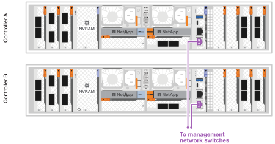
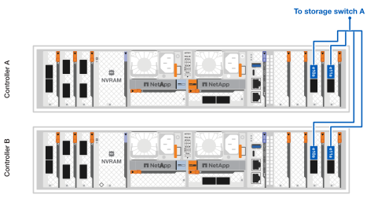

= AFX 1Kストレージシステムのハードウェアを配線する
:allow-uri-read: 
:icons: font
:imagesdir: ../media/

[role="lead"]
AFX 1K ストレージ システムのラック ハードウェアをインストールした後、コントローラのネットワーク ケーブルをインストールし、コントローラとストレージ シェルフ間のケーブルを接続します。

.開始する前に
ストレージ システムをネットワーク スイッチに接続する方法については、ネットワーク管理者に問い合わせてください。

.タスク概要
* これらの手順は一般的な構成を示しています。具体的なケーブル接続は、ストレージ システム用に注文したコンポーネントによって異なります。包括的な構成の詳細とスロットの優先順位については、以下を参照してください。link:https://hwu.netapp.com["NetApp Hardware Universe"^] 。
* AFX コントローラーの I/O スロットには 1 ～ 11 の番号が付けられています。
+
image::../media/drw_a1K_back_slots_labeled_ieops-2162.svg[AFXコントローラーのスロット番号]

* ケーブル接続グラフィックには、コネクタをポートに挿入するときにケーブル コネクタのプルタブの正しい方向 (上または下) を示す矢印アイコンが表示されます。
+
コネクタを挿入すると、カチッと音がして所定の位置に収まるはずです。カチッと音がしない場合は、コネクタを取り外し、裏返してもう一度試してください。

+
image:../media/drw_cable_pull_tab_direction_ieops-1699.svg["ケーブルプルタブの方向"]

+
[NOTE]
====
コネクタ部品は繊細なので、カチッとはめるときは注意が必要です。

====
* 光ファイバー接続にケーブル接続する場合は、スイッチ ポートにケーブル接続する前に、光トランシーバーをコントローラ ポートに挿入します。
* AFX 1K ストレージ システムは、クラスターおよびストレージ ネットワークで 4x100GbE ブレークアウト ケーブルを使用します。 400GbE 接続はスイッチ ポートに対して行われ、100GbE 接続はコントローラおよびドライブ シェルフ ポートに対して行われます。ストレージおよび HA/クラスタ接続は、スイッチ上の任意の非 ISL ポートに行うことができます。
+
特定のスイッチ ポートへの 4x100GbE ブレークアウト ケーブル接続の場合、スイッチに接続する 4 つのポートすべてをこの単一のブレークアウト ケーブルで接続します。

+
** 1 x HA ポート (スロット 1)
** 1 x クラスターポート（スロット 7）
** 2 X ストレージ ポート (スロット 10、11)
+
すべての「a」ポートはスイッチ A に接続し、すべての「b」ポートはスイッチ B に接続します。

NOTE: AFX 1K ストレージ システムへのCisco Nexus 9332D-GX2B および 9364D-GX2A スイッチ構成には、4x100GbE ブレークアウト ケーブル接続が必要です。

== ステップ1: コントローラを管理ネットワークに接続する

各スイッチの管理ポートをいずれかの管理スイッチ (注文した場合) に接続するか、管理ネットワークに直接接続します。

スイッチのPSU側にある右上のポートが管理ポートです。スイッチを設置して管理スイッチまたは管理ネットワークに接続したあとに、各スイッチのCAT6ケーブルをパススルー パネルを通して配線する必要があります。

1000BASE-T RJ-45 ケーブルを使用して、各コントローラの管理 (レンチ) ポートを管理ネットワーク スイッチに接続します。

image::../media/oie_cable_rj45.png[RJ-45ケーブル]

*1000BASE-T RJ-45ケーブル*

IMPORTANT: 電源コードをまだ差し込まないでください。

. ホストネットワークに接続します。

== ステップ2: コントローラーをホストネットワークに接続する

イーサネット モジュール ポートをホスト ネットワークに接続します。

この手順は、I/O モジュールの構成によって異なる場合があります。以下に、一般的なホスト ネットワークのケーブル接続の例を示します。見るlink:https://hwu.netapp.com["NetApp Hardware Universe"^]特定のシステム構成用。

.手順
. 次のポートをイーサネット データ ネットワーク スイッチ A に接続します。
+
** コントローラA（例）
+
*** e2a
*** e3a

** コントローラーB（例）
+
*** e2a
*** e3a
+
*100GbEケーブル*

+
image::../media/oie_cable100_gbe_qsfp28.png[100 Gb イーサネットケーブル]

+
image::../media/drw_afx_network_cabling_a_ieops-2350.svg[ケーブルからイーサネットネットワークへ]

. 次のポートをイーサネット データ ネットワーク スイッチ B に接続します。
+
** コントローラA（例）
+
*** e2b
*** e3b

** コントローラーB（例）
+
*** e2b
*** e3b
+
*100GbEケーブル*

+
image::../media/oie_cable100_gbe_qsfp28.png[100 Gb イーサネットケーブル]

+
image::../media/drw_afx_network_cabling_b_ieops-2351.svg[ケーブルからイーサネットネットワークへ]

== ステップ3: クラスタとHA接続をケーブル接続する

クラスタおよび HA 相互接続ケーブルを使用して、ポート e1a および e7a をスイッチ A に、ポート e1b および e7b をスイッチ B に接続します。e1a/e1b ポートは HA 接続に使用され、e7a/e7b ポートはクラスタ接続に使用されます。

.手順
. 次のコントローラー ポートをクラスター ネットワーク スイッチ A 上の任意の非 ISL ポートに接続します。
+
** コントローラA
+
*** e1a
*** e7a

** コントローラB
+
*** e1a
*** e7a
+
*100GbEケーブル*

+
image::../media/oie_cable_25Gb_Ethernet_SFP28_ieops-1069.png[クラスタHAケーブル]

+
image::../media/drw_afx_switched_cluster_cabling_a_ieops-2352.svg[クラスターネットワークへのクラスター接続のケーブル接続]

. 次のコントローラー ポートをクラスター ネットワーク スイッチ B 上の任意の非 ISL ポートに接続します。
+
** コントローラA
+
*** e1b
*** e7b

** コントローラB
+
*** e1b
*** e7b
+
*100GbEケーブル*

+
image::../media/oie_cable_25Gb_Ethernet_SFP28_ieops-1069.png[クラスタHAケーブル]

+
image::../media/drw_afx_switched_cluster_cabling_b_ieops-2353.svg[クラスターネットワークへのクラスター接続のケーブル接続]

== ステップ4: コントローラとスイッチのストレージ接続をケーブルで接続する

コントローラのストレージ ポートをスイッチに接続します。スイッチに適切なケーブルとコネクタがあることを確認してください。見る https://hwu.netapp.com["Hardware Universe"^]詳細についてはこちらをご覧ください。

. 次のストレージ ポートをスイッチ A の任意の非 ISL ポートに接続します。
+
** コントローラA
+
*** e10a
*** e11a

** コントローラB
+
*** e10a
*** e11a
+
*100GbEケーブル*

+
image::../media/oie_cable100_gbe_qsfp28.png[100Gbケーブル]

+

. 次のストレージ ポートをスイッチ B の任意の非 ISL ポートに接続します。
+
** コントローラA
+
*** e10b
*** e11b

** コントローラB
+
*** e10b
*** e11b
+
*100GbEケーブル*

+
image::../media/oie_cable100_gbe_qsfp28.png[100Gbケーブル]

+
image::../media/drw_afx_controller_storage_cable_b_ieops-2355.svg[コントローラストレージをスイッチBにケーブル接続する]

== ステップ5: シェルフとスイッチ間の接続を配線する

NX224 ストレージ シェルフをスイッチに接続します。

ストレージシステムでサポートされるシェルフの最大数とすべてのケーブル接続オプションについては、link:https://hwu.netapp.com["NetApp Hardware Universe"^] 。

. モジュール A のスイッチ A とスイッチ B の任意の非 ISL ポートに次のシェルフ ポートを接続します。
+
** モジュールAからスイッチAへの接続
+
*** e1a
*** e2a
*** e3a
*** e4a

** モジュールAからスイッチBへの接続
+
*** e1b
*** e2b
*** e3b
*** e4b
+
*100GbEケーブル*

+
image::../media/oie_cable100_gbe_qsfp28.png[100Gbケーブル]

+
image::../media/drw_afx_shelf_cabling_a_ieops-2356.svg[スイッチAとスイッチBへのケーブルシェルフ]

. モジュール B のスイッチ A とスイッチ B の任意の非 ISL ポートに次のシェルフ ポートを接続します。
+
** モジュールBからスイッチAへの接続
+
*** e1a
*** e2a
*** e3a
*** e4a

** モジュールBからスイッチBへの接続
+
*** e1b
*** e2b
*** e3b
*** e4b
+
*100GbEケーブル*

+
image::../media/oie_cable100_gbe_qsfp28.png[100Gbケーブル]

+
image::../media/drw_afx_shelf_cabling_b_ieops-2357.svg[スイッチAとスイッチBへのケーブルシェルフ]

.次の手順
ハードウェアの配線後、link:power-on-configure-switch.html["スイッチの電源を入れて設定する"] 。
